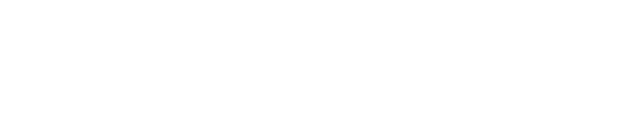

# *K*-*P* Flow:
Analysis of gradient descent learning in general recurrent models using operators

See accompanying theory paper (soon to be updated with a full rewrite): https://arxiv.org/abs/2507.06381 and paper on the RNLA aspect of the code: https://arxiv.org/abs/2511.10796

# Installation:
In the root directory run `pip install -e .`
<br>
You can then install the library in your python code using `from kpflow import ...` (see Examples)

# Examples:
**examples/example_1:** Example operator usage, including training, sweeping of initial weight scale and analysis (Experiment 1 in main paper).

# Summary poster 2025:


# Citing
Please cite the accompanying pre-print:
```
@misc{hazelden2025kpflow,
      title={KPFlow: An Operator Perspective on Dynamic Collapse Under Gradient Descent Training of Recurrent Networks}, 
      author={James Hazelden and Laura Driscoll and Eli Shlizerman and Eric Shea-Brown},
      year={2025},
      eprint={2507.06381},
      archivePrefix={arXiv},
      primaryClass={cs.LG},
      url={https://arxiv.org/abs/2507.06381}, 
}
```
