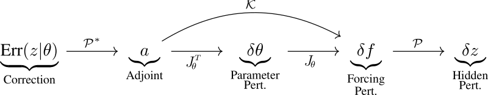

# *K*-*P* Flow:
Analysis of gradient descent learning in general recurrent models using operators

See accompanying paper: https://arxiv.org/abs/2507.06381

# Installation:
In the root directory run `pip install -e .`
 
You can then install the library in your python code using `from kpflow import ...` (see Examples)

# Examples:
**examples/example_1:** Example operator usage, including training, sweeping of initial weight scale and analysis (Experiment 1 in main paper).
